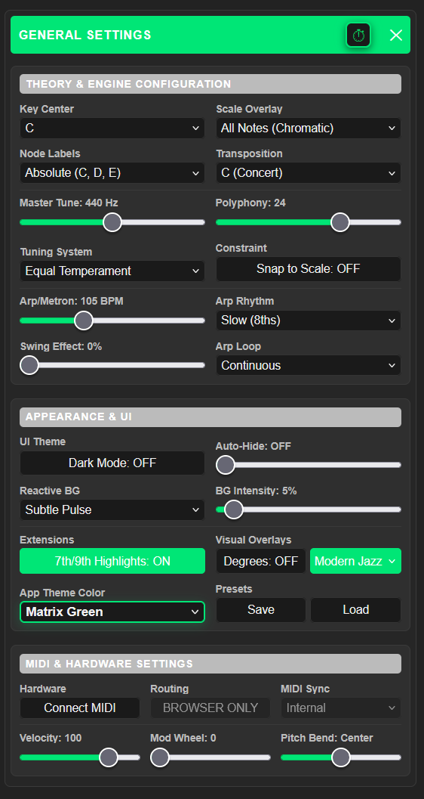
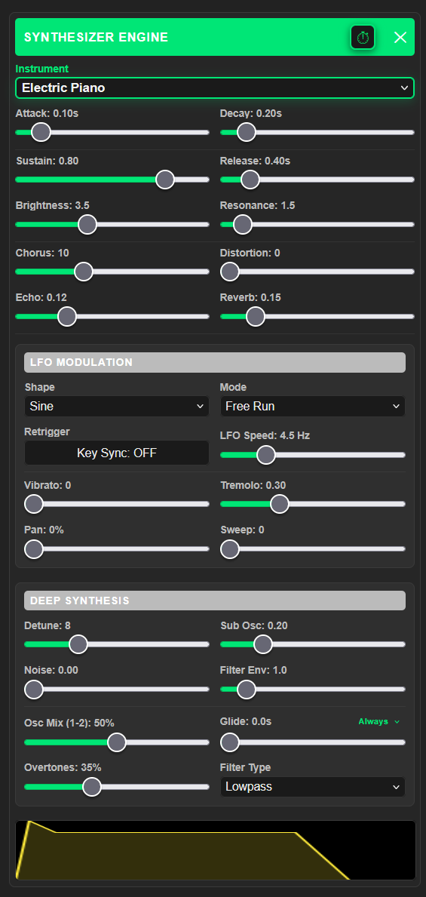
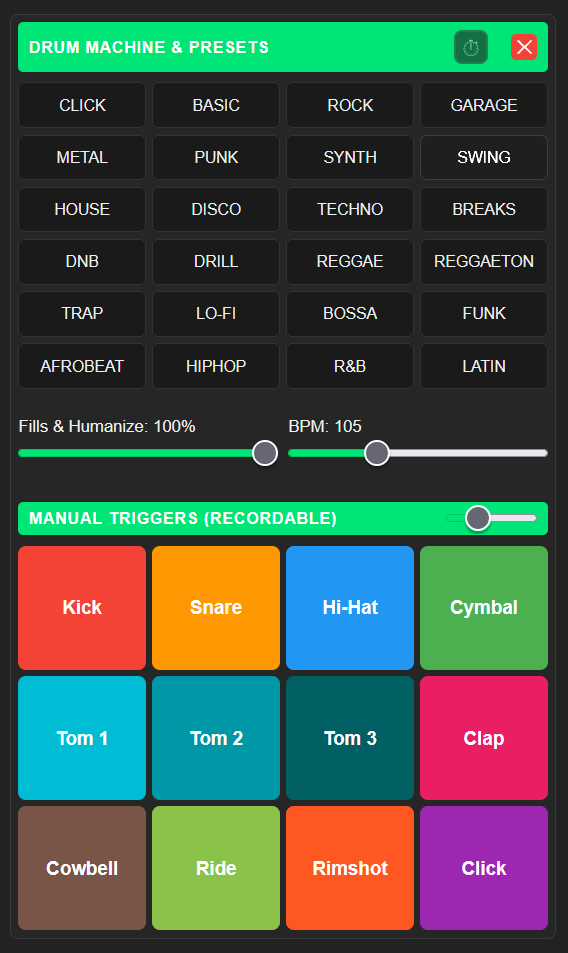
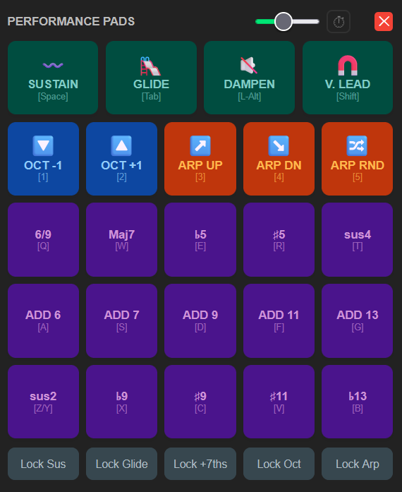
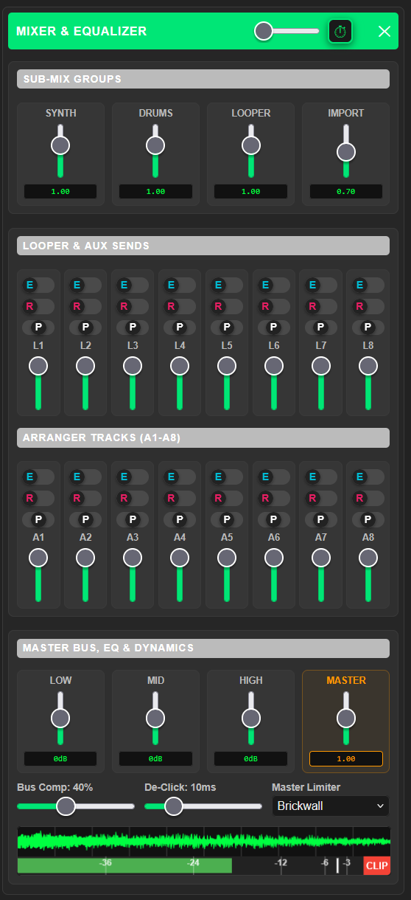
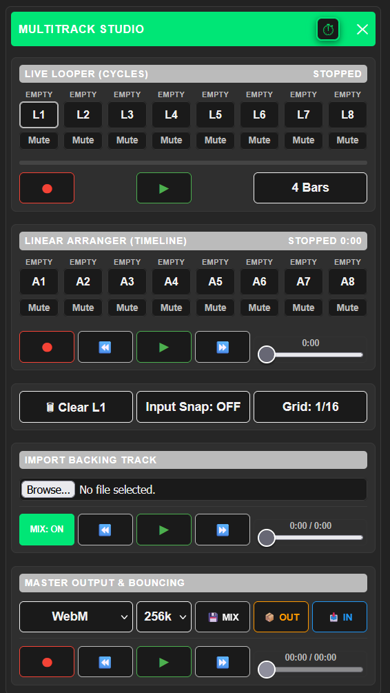
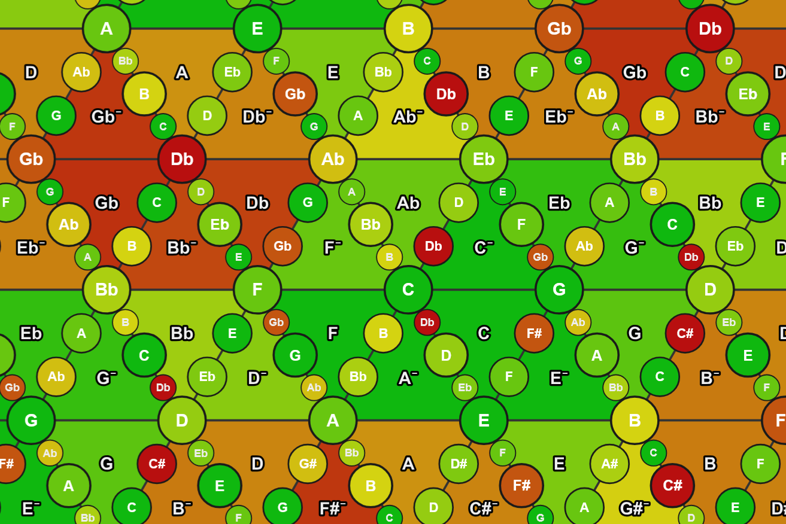
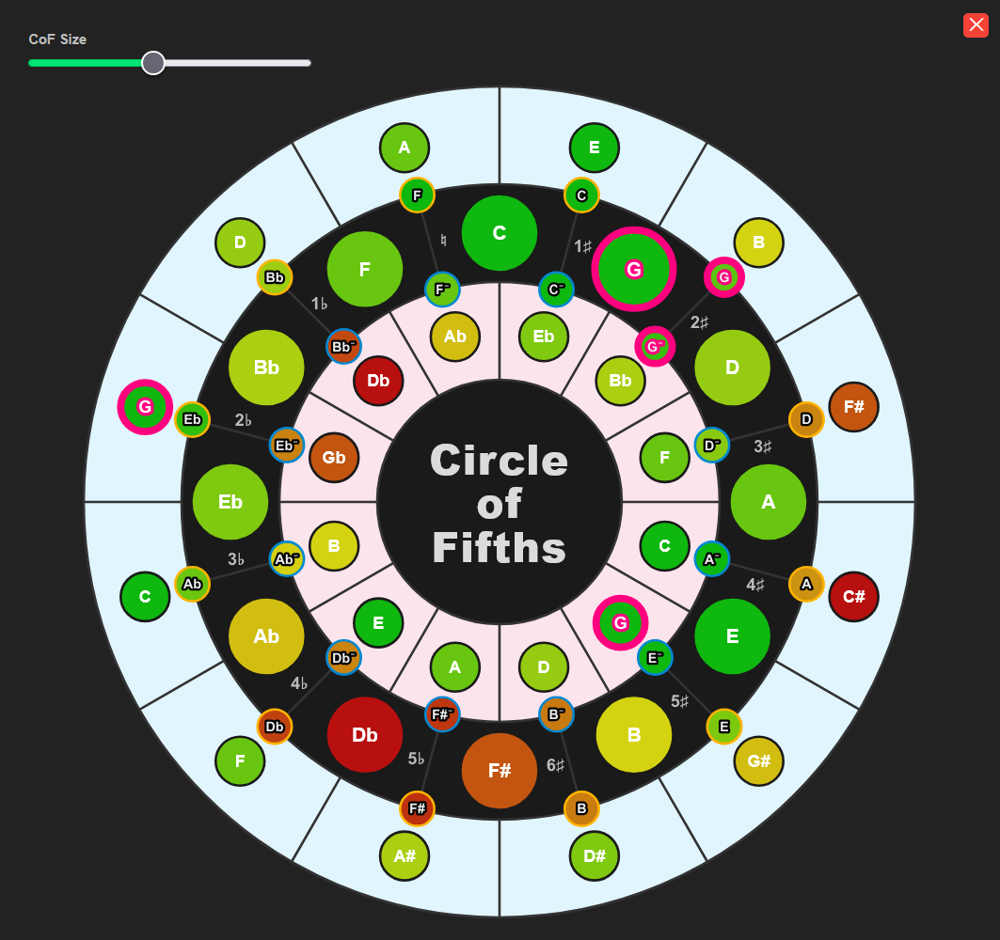

<div>
  
</div>
<div>
  
  <h1>Tonnetz Pro</h1>
  <p><strong>A Digital Audio Workstation (DAW) and music theory tool with synthesizer, and live performance environment wrapped around Euler's "Tonnetz".</strong></p>
  <p>Tonnetz Pro maps harmonic relationships to physical space, allowing for the intuitive visualization and performance of complex chord structures. By translating musical intervals into a two-dimensional grid, users can explore tonal gravity, voice leading, and advanced chord extensions using visual memory rather than traditional linear keyboard mapping.</p>
  <p>Engineered as a zero-dependency vanilla JS architecture, the application operates as a fully-featured, offline-capable Digital Audio Workstation (DAW) natively in the browser, featuring full DAW interoperability and persistent local storage.</p>
</div>
<br clear="both"/>

---

### **INSTALL:** Select the native installer for your OS under "Releases".
### ... or run directly in the browser: [Tonnetz Pro Web](https://cyberchriz.github.io/musictools/ui/index.html)
> ## **NOTE:** Firefox is strongly recommended for the browser version due to superior Web Audio API performance. The web build operates as an offline-capable PWA.

---

# Architecture & Features

### 16-Track Recording Studio
* **Hybrid Engine:** A 16-track recording environment divided into an 8-track cyclical Looper (L1-L8) and an 8-track linear Arranger timeline (A1-A8).
* **Agnostic Recording:** Tracks automatically adapt to incoming data (voice/synthesizer data vs. drum machine triggers). 
* **Preset Sync:** Recording while a drum preset is active automatically snaps to the next downbeat and commits the sequenced pattern to the active drum track.
* **Master Bounce:** Real-time audio bouncing of the master output bus to downloadable WebM, MP4, MP3, or uncompressed WAV files.

### Geometric Interface & Navigation
* **Tonal Mapping:** Perfect fifths mapped to the horizontal axis; major/minor thirds mapped to diagonals.
* **Triads & Extensions:** Upward triangles yield major triads; downward yield minor. Use the multi-touch grid and combine with physical keyboard shortcuts (keyboard rows QWERT / ASDFG / Y(Z)XCVB), or the left-docked Performance Pads to instantly inject complex jazz extensions (sus2, sus4, ♭5, ♯5, ♭9, ♯11, 13).
* **Live Modifiers:** Hold Shift for Voice Leading (prioritizes minimal movement between chords), Space for 'Systain', L-Alt for 'Dampen' and 'Tab' for Legato (glide).
* **Arpeggiator:** Supports directional and randomized sequence arpeggiation with adjustable swing, subdivisions, and continuous looping.
* **Responsive UI:** Smart FAB (Floating Action Button) menu and per-panel Auto-Hide toggles maximize screen real estate on mobile devices by dynamically hiding controls during active play.

### Drum Machine
* **24 Pre-Programmed Kits:** chose from a diverse library of styles.
* **Manual Triggers:** Use to play your own beat patterns or embellish the presets in real-time. Record everything into the looper or arranger.
* **Auto-Embellishments:** let the drum AI automatically add fills and variations for a more "human" feel.

### Advanced Music Theory Tools
* **Interactive Circle of Fifths:** A synchronized harmonic minimap that tracks and highlights active chord structures in real-time.
* **Scale Constraints:** Snap-to-scale functionality locking the grid to 20+ standard modes, pentatonics, or exotic scales (e.g., Lydian Dominant, Hungarian Minor).
* **Tuning Systems:** Switch the engine from Equal Temperament to Just Intonation or Pythagorean Tuning for mathematically perfect, beatless ratios.
* **Dynamic Labels:** Toggle node labels between absolute pitch, scale degrees, Roman numerals, or Solfege.

### Harmonic Heatmap + Local & Sequence Gravity Engine
* **Real-time compositional assistant:** visualizes musical tension and predicts functional chord resolutions on the Tonnetz grid.
* **Psychoacoustic Heatmap:** Colors nodes based on calculated dissonance against your active chord (Green / Yellow: Stable, consonant chord tones, Orange / Red: High tension and harsh dissonances (e.g., minor 2nds))
* **Genre-weighted Tuning:** Select Classical, Pop/Rock or Jazz to shift the mathematical interval weights. (e.g., A Major 7th highlights as a tense red in Classical, but a stable green in Jazz).
* **Gravity Beacons:** Visualizes where unstable chords (Dom7, Dim, Sus) and Jazz Tritone substitutions want to resolve using high-contrast hollow borders and glowing text outlines:
    - Local Gravity (Cyber Blue): Isolated chord resolutions (e.g., a lone G7 targeting C)
    - Sequence Gravity (Synthwave Pink): Grammatical progression endings.
    - Tracks chord history and triggers on strong cadences (ii -> V, IV -> V, or chromatic walkdowns).
* **BPM-Synced Harmonic Buffer:** Decouples harmonic analysis from raw keypresses using a rolling, tempo-synced memory.
* **Arpeggio Support:** A 1.5-beat memory window aggregates individually fingerpicked/rolled notes into a single harmonic entity for accurate Heatmap evaluation.
* **Passing Chord Immunity:** Remembers the last 3 macro-chords, ignoring quick melody notes and passing chords to accurately identify the underlying progression.

### Audio Engine & Sampling
* **Dual-Oscillator Synthesizer:** Procedural subtractive audio engine featuring 33 pre-calibrated acoustic and analog presets.
* **Persistent User Samples:** Hardware-style sampler supporting custom `.wav` loading. Uploaded files are committed to the browser's native IndexedDB, ensuring custom sample libraries survive page reloads and operate entirely offline.
* **Dynamics & Envelopes:** Visual ADSR envelope controls and a user-adjustable "De-Click" micro-fade engine (0-50ms) to prevent hardware zero-crossing pops during fast arpeggios.
* **Modulation & Effects:** Multi-LFO system (routing to pitch, amplitude, and filter cutoff), dedicated sub/noise oscillators, and a global effects chain (distortion, chorus, delay, reverb).

### Hardware & MIDI Integration
* **Duplex Web MIDI API:** Play the internal engine using USB MIDI controllers (SLAVE), or use Tonnetz Pro as a geometric MIDI controller to drive external DAW hardware (MASTER).
* **Clock Synchronization:** Configurable MIDI Clock routing. Act as a Master clock to drive external gear, or slave the internal Arpeggiator and Looper to an external tempo.

### DAW Interoperability (`.dawproject`)
* **Project Export:** Generates an open-source `.dawproject` archive compatible with Bitwig Studio, Studio One, and Cubase. The export compiles high-quality WAV stems, raw binary MIDI performance files, an XML manifest, and the embedded native JSON state.
* **Non-Destructive Recall:** Importing a native Tonnetz `.dawproject` restores the exact UI state, synthesizer parameters, and MIDI events.
* **Foreign Project Import:** Uploading a `.dawproject` generated by an external DAW invokes an XML skimmer to extract track names, track colors, and BPM, safely dropping the foreign audio stems directly onto the Arranger timeline for playback.

---
# UI Screenshots
<div class="control-row" style="grid-template-columns: repeat(3, 1fr) display: flex; justify-content: space-between; flex-wrap: wrap;">
        
        
        
        
        
        
        
        
</div>

___

# Local Build (Desktop)

Tonnetz Pro is wrapped in a native Rust backend via [Tauri](https://tauri.app/) to provide a high-performance desktop executable. 

**Prerequisites:**
* [Node.js](https://nodejs.org/)
* [Rust Toolchain](https://rustup.rs/)

**Run in Development Mode:**
```bash
npm install
npx tauri dev
```
---

# Third-Party Acknowledgements

Tonnetz Pro utilizes the following open-source library, which is distributed under its respective license:

* **[JSZip](https://github.com/Stuk/jszip)** (Dual-licensed under MIT / GPLv3)
  Used under the **MIT License**.
  Copyright (c) 2009-2016 Stuart Knightley, David Duponchel, Franz Buchinger, António Afonso.
---
# License

Copyright (c) 2026 Christian Suer (GitHub: cyberchriz). All rights reserved.

<details>
<summary><strong>View Full License Terms</strong></summary>

<br>

> Permission is granted for personal, non-commercial use and execution only. 
> No part of this software may be redistributed or used for 
> commercial purposes without explicit written permission from the author.
> Modification and derivative works are permitted for personal use as local builds
> in accordance with the above terms, but may not be distributed or used commercially.
>
> For commercial licensing inquiries or acquisition offers, please contact 
> the author via GitHub.

</details>

*For more details, see the full [LICENSE.md](LICENSE.md) file.*
